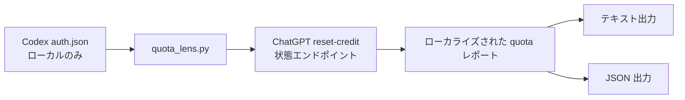

<h1 align="center">Codex Quota Lens</h1>

<p align="center">
  ChatGPT/Codex の reset-credit 利用回数、有効期限、リマインダー時刻を確認するための専用 Codex skill。
</p>

<p align="center">
  <a href="./README.md">English</a>
  ·
  <a href="./README.zh.md">中文</a>
  ·
  <a href="./README.ja.md">日本語</a>
</p>

<p align="center">
  
  
  
  
</p>

---

## 概要

Codex Quota Lens は、ローカル Codex の ChatGPT 認証状態を読み取り、quota window として見やすく表示します。

| 情報 | 出力内容 |
| --- | --- |
| 利用可能回数 | 現在の reset-credit 数 |
| 残り時間 | 各 reset credit の有効期限までの時間 |
| ローカル有効期限 | 指定タイムゾーンへ変換した有効期限 |
| リマインダー | 期限の 1 日前と 1 時間前 |
| 自動化出力 | スクリプト、通知、後続処理向け JSON |

目的を絞った構成です。1 つの skill、1 つのスクリプト、1 つの役割だけを持ちます。バックグラウンドサービスをインストールせず、認証情報を保存せず、外部システムにも書き込みません。

## Skill

### `codex-quota-lens`

| 項目 | 詳細 |
| --- | --- |
| 依存 | サードパーティ Python パッケージ不要 |
| 前提 | ローカル Codex が ChatGPT でログイン済み |
| ネットワーク | 問い合わせ時のみ ChatGPT web reset-credit 状態エンドポイントにアクセス |
| 言語 | `en`、`zh`、`ja`、または locale 自動判定 |
| タイムゾーン | `auto` または `Asia/Tokyo` など任意の IANA タイムゾーン |

## フロー



## インストール

Codex にこのリポジトリから skill をインストールするよう依頼します。

```text
https://github.com/tsetsugekka/codex-quota-lens から Codex Quota Lens をインストールしてください。
```

一時的に使うだけなら、リポジトリを clone してスクリプトを直接実行できます。

## 実行

自動言語 + ローカルタイムゾーン：

```bash
python3 skills/codex-quota-lens/scripts/quota_lens.py --lang auto --timezone auto
```

日本語 + 日本時間：

```bash
python3 skills/codex-quota-lens/scripts/quota_lens.py --lang ja --timezone Asia/Tokyo
```

中国語 + 中国時間：

```bash
python3 skills/codex-quota-lens/scripts/quota_lens.py --lang zh --timezone Asia/Shanghai
```

英語 + 米国太平洋時間：

```bash
python3 skills/codex-quota-lens/scripts/quota_lens.py --lang en --timezone America/Los_Angeles
```

JSON：

```bash
python3 skills/codex-quota-lens/scripts/quota_lens.py --lang ja --timezone Asia/Tokyo --json
```

auth ファイルを指定：

```bash
python3 skills/codex-quota-lens/scripts/quota_lens.py --auth-file ~/.codex/auth.json
```

## リクエスト例

```text
現在の Codex リセット回数と有効期限を日本時間で表示して。

Codex のリセットクレジットを日本語で表示し、各クレジットのリマインダー時刻も出して。

現在利用可能なリセット回数と、各クレジットの残り時間を教えて。

現在の reset-credit 状態を JSON で出力して。

各リセットクレジットについて、期限の 1 日前と 1 時間前の通知時刻を教えて。
```

## 出力形式

テキスト出力は素早く読める形にしています。

```text
Codex リセット回数：2
1 回目のリセット：
  残り時間：19日 14時間 30分 34秒
  有効期限：2026-07-27 08:55:34（Asia/Tokyo）
  リマインダー：
    - 期限の 1 日前：2026-07-26 08:55:34（Asia/Tokyo）
    - 期限の 1 時間前：2026-07-27 07:55:34（Asia/Tokyo）
```

JSON 出力には次のフィールドが含まれます。

| フィールド | 意味 |
| --- | --- |
| `language` | 実際に使用した出力言語 |
| `timezone` | 実際に使用した表示タイムゾーン |
| `generated_at_utc` | 生成時刻 |
| `available_count` | 利用可能な reset-credit 数 |
| `credits[].remaining` | ローカライズ済み残り時間 |
| `credits[].expires_at_utc` | UTC 有効期限 |
| `credits[].expires_at_local` | 選択タイムゾーンでの有効期限 |
| `credits[].reminders[]` | リマインダー時刻 |

## 安全性

| ルール | 詳細 |
| --- | --- |
| Token 読み取り | 現在の ChatGPT access token を取得するためだけにローカル `auth.json` を読む |
| Token 出力 | token は出力しない |
| リクエスト範囲 | token は reset-credit 状態エンドポイントへの Authorization header としてのみ送信 |
| リポジトリ衛生 | `.codex/`、`auth.json`、`.env*`、SQLite 状態、キャッシュファイルを除外 |
| 失敗時 | エンドポイントや auth 形式が変わった場合は、認証情報を手動コピーせずスクリプトを更新する |

## リポジトリ構成

```text
skills/
  codex-quota-lens/
    SKILL.md
    agents/
      openai.yaml
    scripts/
      quota_lens.py
README.md
README.zh.md
README.ja.md
LICENSE
```

## ライセンス

MIT
