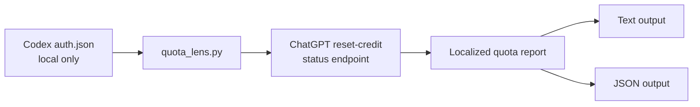

<h1 align="center">Codex Quota Lens</h1>

<p align="center">
  A focused Codex skill for checking ChatGPT/Codex reset-credit availability, expiry windows, and reminder times.
</p>

<p align="center">
  <a href="./README.md">English</a>
  ·
  <a href="./README.zh.md">中文</a>
  ·
  <a href="./README.ja.md">日本語</a>
</p>

<p align="center">
  
  
  
  
</p>

---

## What It Does

Codex Quota Lens turns the local Codex ChatGPT auth state into a readable quota window:

| Signal | What you get |
| --- | --- |
| Available credits | Current reset-credit count |
| Remaining time | How long each reset credit stays valid |
| Local expiry | Expiry converted to your chosen time zone |
| Reminder schedule | One day and one hour before each expiry |
| Automation output | JSON for scripts, reminders, or follow-up workflows |

It is intentionally narrow: one skill, one script, one job. It does not install a service, store credentials, or write to external systems.

## Skill

### `codex-quota-lens`

| Area | Detail |
| --- | --- |
| Dependency | No third-party Python packages |
| Required state | Local Codex is logged in with ChatGPT |
| Network | Calls the ChatGPT web reset-credit status endpoint only when queried |
| Languages | `en`, `zh`, `ja`, or locale auto-detection |
| Time zones | `auto` or any IANA zone such as `Asia/Tokyo` |

## Flow



## Install

Ask Codex to install the skill from this repository:

```text
Install Codex Quota Lens from https://github.com/tsetsugekka/codex-quota-lens.
```

For a one-off check, clone the repository and run the script directly.

## Run

Auto language and local machine time:

```bash
python3 skills/codex-quota-lens/scripts/quota_lens.py --lang auto --timezone auto
```

English with Pacific Time:

```bash
python3 skills/codex-quota-lens/scripts/quota_lens.py --lang en --timezone America/Los_Angeles
```

Chinese with China time:

```bash
python3 skills/codex-quota-lens/scripts/quota_lens.py --lang zh --timezone Asia/Shanghai
```

Japanese with Japan time:

```bash
python3 skills/codex-quota-lens/scripts/quota_lens.py --lang ja --timezone Asia/Tokyo
```

JSON:

```bash
python3 skills/codex-quota-lens/scripts/quota_lens.py --lang en --timezone UTC --json
```

Specific auth file:

```bash
python3 skills/codex-quota-lens/scripts/quota_lens.py --auth-file ~/.codex/auth.json
```

## Example Prompts

```text
Show my current Codex quota reset status in English and Pacific Time.

查询一下我当前 Codex 重置次数和有效期，用北京时间显示。

用日语显示我的 Codex reset credits，并按日本时间列出提醒时间。

Output my current reset-credit status as JSON.

Tell me when each reset credit should be reminded 1 day and 1 hour before expiry.
```

## Output Shape

Text output is designed for quick reading:

```text
Codex reset credits: 2
Reset credit 1:
  Remaining: 19d 14h 30m 34s
  Expires: 2026-07-26 16:55:34 (America/Los_Angeles)
  Reminders:
    - 1 day before expiry: 2026-07-25 16:55:34 (America/Los_Angeles)
    - 1 hour before expiry: 2026-07-26 15:55:34 (America/Los_Angeles)
```

JSON output includes:

| Field | Meaning |
| --- | --- |
| `language` | Resolved output language |
| `timezone` | Resolved display time zone |
| `generated_at_utc` | Query generation timestamp |
| `available_count` | Available reset-credit count |
| `credits[].remaining` | Localized remaining duration |
| `credits[].expires_at_utc` | Expiry in UTC |
| `credits[].expires_at_local` | Expiry in selected time zone |
| `credits[].reminders[]` | Reminder schedule |

## Safety

| Rule | Detail |
| --- | --- |
| Token handling | Reads local `auth.json` only to obtain the current ChatGPT access token |
| Token output | Never prints the token |
| Request scope | Sends the token only as an Authorization header to the reset-credit status endpoint |
| Repository hygiene | Excludes `.codex/`, `auth.json`, `.env*`, SQLite state, and cache files |
| Failure mode | If the endpoint or auth format changes, update the script instead of copying credentials manually |

## Repository Layout

```text
skills/
  codex-quota-lens/
    SKILL.md
    agents/
      openai.yaml
    scripts/
      quota_lens.py
README.md
README.zh.md
README.ja.md
LICENSE
```

## License

MIT
