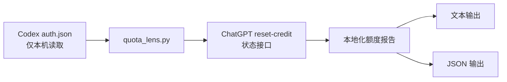

<h1 align="center">Codex Quota Lens</h1>

<p align="center">
  一个用于查看 ChatGPT/Codex reset-credit 可用次数、有效期和提醒时间的专用 Codex skill。
</p>

<p align="center">
  <a href="./README.md">English</a>
  ·
  <a href="./README.zh.md">中文</a>
  ·
  <a href="./README.ja.md">日本語</a>
</p>

<p align="center">
  
  
  
  
</p>

---

## 功能定位

Codex Quota Lens 会把本机 Codex 的 ChatGPT 登录状态整理成一份可读的额度窗口：

| 信号 | 输出内容 |
| --- | --- |
| 可用次数 | 当前 reset-credit 数量 |
| 剩余时间 | 每次 reset credit 还有多久过期 |
| 当地过期时间 | 按指定时区换算后的过期时间 |
| 提醒时间表 | 过期前 1 天和过期前 1 小时 |
| 自动化输出 | 可交给脚本、提醒或后续流程的 JSON |

它是一个边界很窄的工具：一个 skill、一个脚本、一个目标。不安装后台服务，不保存凭据，不写入外部系统。

## Skill

### `codex-quota-lens`

| 项目 | 说明 |
| --- | --- |
| 依赖 | 不需要第三方 Python 包 |
| 前置状态 | 本机 Codex 已通过 ChatGPT 登录 |
| 网络请求 | 仅在查询时访问 ChatGPT web reset-credit 状态接口 |
| 语言 | `en`、`zh`、`ja`，或根据 locale 自动判断 |
| 时区 | `auto` 或任意 IANA 时区，例如 `Asia/Tokyo` |

## 流程



## 安装

在 Codex 里直接让它从这个仓库安装：

```text
请从 https://github.com/tsetsugekka/codex-quota-lens 安装 Codex Quota Lens。
```

如果只是临时查询，也可以克隆仓库后直接运行脚本。

## 运行

自动语言和本机当地时间：

```bash
python3 skills/codex-quota-lens/scripts/quota_lens.py --lang auto --timezone auto
```

中文 + 中国时间：

```bash
python3 skills/codex-quota-lens/scripts/quota_lens.py --lang zh --timezone Asia/Shanghai
```

日语 + 日本时间：

```bash
python3 skills/codex-quota-lens/scripts/quota_lens.py --lang ja --timezone Asia/Tokyo
```

英语 + 美西时间：

```bash
python3 skills/codex-quota-lens/scripts/quota_lens.py --lang en --timezone America/Los_Angeles
```

JSON：

```bash
python3 skills/codex-quota-lens/scripts/quota_lens.py --lang zh --timezone Asia/Shanghai --json
```

指定 auth 文件：

```bash
python3 skills/codex-quota-lens/scripts/quota_lens.py --auth-file ~/.codex/auth.json
```

## 示例请求

```text
查询一下我当前 Codex 重置次数和有效期，用北京时间显示。

查询我的 Codex 重置额度，并按北京时间列出过期时间和提醒时间。

用中文显示当前可用重置次数，并输出每次额度还有多久过期。

查询当前可用重置次数，并输出 JSON。

看一下每个重置额度在过期前 1 天和 1 小时分别应该什么时候提醒。
```

## 输出形态

文本输出适合快速阅读：

```text
Codex 重置次数：2
第 1 次重置：
  剩余时间：19天 14小时 30分钟 34秒
  过期时间：2026-07-27 07:55:34（Asia/Shanghai）
  提醒时间：
    - 过期前 1 天：2026-07-26 07:55:34（Asia/Shanghai）
    - 过期前 1 小时：2026-07-27 06:55:34（Asia/Shanghai）
```

JSON 输出包含：

| 字段 | 含义 |
| --- | --- |
| `language` | 实际使用的输出语言 |
| `timezone` | 实际使用的展示时区 |
| `generated_at_utc` | 查询生成时间 |
| `available_count` | 可用 reset-credit 数量 |
| `credits[].remaining` | 本地化剩余时间 |
| `credits[].expires_at_utc` | UTC 过期时间 |
| `credits[].expires_at_local` | 指定时区过期时间 |
| `credits[].reminders[]` | 提醒时间表 |

## 安全说明

| 规则 | 说明 |
| --- | --- |
| Token 读取 | 只读取本机 `auth.json` 以取得当前 ChatGPT access token |
| Token 输出 | 永不打印 token |
| 请求范围 | token 只作为 Authorization header 发送给 reset-credit 状态接口 |
| 仓库卫生 | 排除 `.codex/`、`auth.json`、`.env*`、SQLite 状态和缓存文件 |
| 失败处理 | 如果接口或 auth 格式变化，应更新脚本，而不是手动复制凭据 |

## 仓库结构

```text
skills/
  codex-quota-lens/
    SKILL.md
    agents/
      openai.yaml
    scripts/
      quota_lens.py
README.md
README.zh.md
README.ja.md
LICENSE
```

## 许可证

MIT
